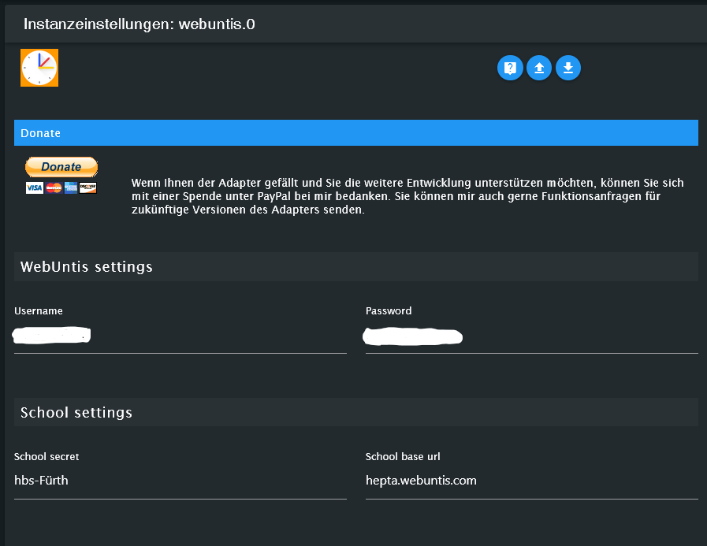

# ioBroker.webuntis

**Tests:** 

## webuntis adapter for ioBroker

Dieser Adapter bezieht Daten aus Webuntis. Für eine deutsche Anleitung 
This Adapter get data from WebUntis. For english-tutorial 

## Konfiguration
Nach der Installation des Adapters in Iobroker und dem erstellen einer Instanz, erscheint automatisch
das Konfigurationsfesnter.

Zur Vorbereitung, geht man in einem Webbrowser auf die Seite 
Im Suchfeld auf der Seite gibt man den gewünschten Schulnamen ein.
Daraufhin öffnet sich eine Webseite. In der Adresszeile des Browsers stehen nun die gewünschten Daten.

Wir benötigen folgende Strings aus der Adresszeile

- the base-url 
- the school-secret

Im Beispiel-Screenshot sind dies folgende Daten als Beispiel:
https://hepta.webuntis.com/WebUntis/?school=hbs-F%C3%BCrth#/basic/login
        hepta.webuntis.com    => the schoolbase-URL
                                            hbs-F%C3%BCrth   => the school-secret

Nun wechselt man in Iobroker-Konfigurationsfenster des Adapters

- Unter Username (Kind oder Elternteil) gibt man den Benutzernamen ein.
- Unter Passwort, das Passwort des Users
- Unter school-secret gibt man den Teil der Webadresse ein, der zwischen "/?school" und "#/" steht
- Unter schoolbase-URL gibt man den Teil der Webadresse ein, der zwischen "https://" und "/webuntes/" steht

Speichern und nun erhält man alle Daten die der Adapter abrufen kann.

Wer Anregungen zur Verbesserung des Adapters hat, kann gerne einen hier oder im Iobroker-Forum an uns weiterleiten:
https://forum.iobroker.net/topic/51690/tester-neuer-adapter-webuntis

## Changelog
<!--
    Placeholder for the next version (at the beginning of the line):
    ### **WORK IN PROGRESS**
-->

### **WORK IN PROGRESS**
* (Newan) initial release

## License
MIT License

Copyright (c) 2022 Newan <info@newan.de>

Permission is hereby granted, free of charge, to any person obtaining a copy
of this software and associated documentation files (the "Software"), to deal
in the Software without restriction, including without limitation the rights
to use, copy, modify, merge, publish, distribute, sublicense, and/or sell
copies of the Software, and to permit persons to whom the Software is
furnished to do so, subject to the following conditions:

The above copyright notice and this permission notice shall be included in all
copies or substantial portions of the Software.

THE SOFTWARE IS PROVIDED "AS IS", WITHOUT WARRANTY OF ANY KIND, EXPRESS OR
IMPLIED, INCLUDING BUT NOT LIMITED TO THE WARRANTIES OF MERCHANTABILITY,
FITNESS FOR A PARTICULAR PURPOSE AND NONINFRINGEMENT. IN NO EVENT SHALL THE
AUTHORS OR COPYRIGHT HOLDERS BE LIABLE FOR ANY CLAIM, DAMAGES OR OTHER
LIABILITY, WHETHER IN AN ACTION OF CONTRACT, TORT OR OTHERWISE, ARISING FROM,
OUT OF OR IN CONNECTION WITH THE SOFTWARE OR THE USE OR OTHER DEALINGS IN THE
SOFTWARE.